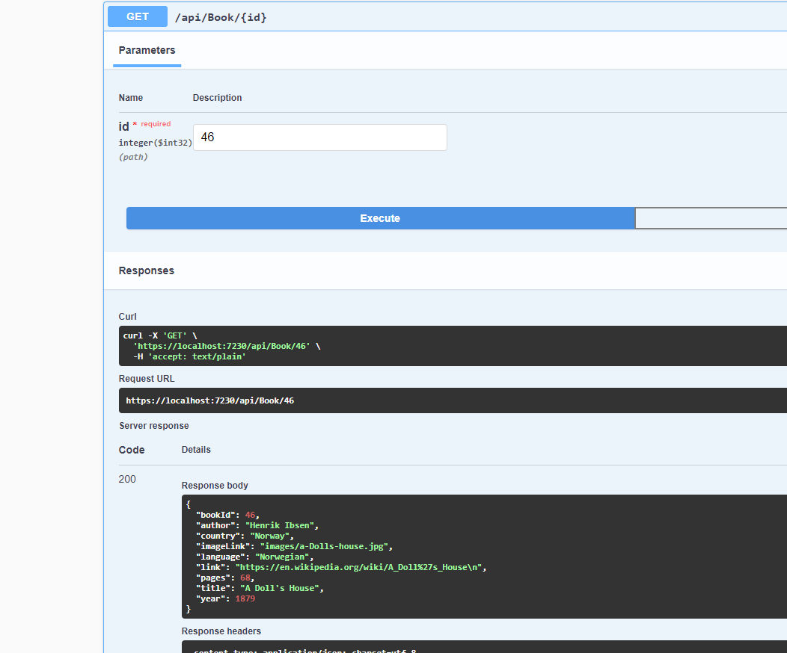
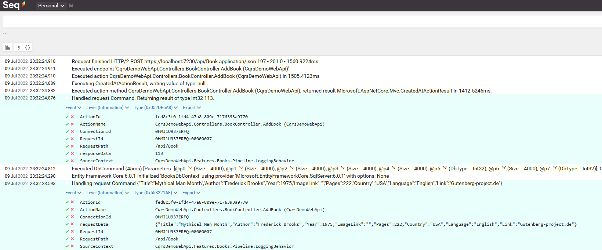

## How to set up the demo

This demo shows how to use MediatR and EF Core to test out 
some CQRS functionality.

Edit the appsettings.json and adjust it to point the 
connection string to your database instance. I use 'SqlExpress01'
but you might use the standard 'SqlExpress'

Run inside Package Manager Console:
Update-Database

You can also run this command if you have installed 
dotnet commands for EF : 
dotnet ef database update

Now hit F5 to run the application. You should see 
Swagger and be able to play along with calls to the API 
which again should call MediatR and demonstrate some simple
CQRS usage towards Sql Server / EntityFrameworkCore




Sample data for a new book to be inserted into the book db : 

```json
{
  "title": "Mythical Man Month",
  "author": "Frederick Brooks",
  "year": 1975,
  "country": "USA",
  "imagelink": "",
  "pages": 222,
  "language": "English",
  "link": "Gutenberg-project.de"
}

```

The demo shows logging also inside Seq (via SeriLog) ! 




Last update : 07. July 2022 